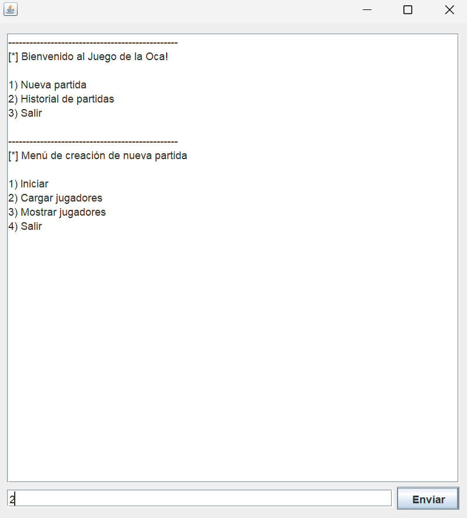

# Trabajo Práctico POO
Alumno: Gonzalo Benito

Universidad: UNLu

Año: 2022

Materia: Programación Orientada a Objetos

# Vista Consola

## Modo de uso

- Indicar en el input la opción
- 1\) Nueva partida
  - 1\) Iniciar
  - 2\) Cargar jugadores
    - Ingresar la cantidad de jugadores
    - Ingresar, por cada jugador, su nombre (string), y seleccionar una ficha de las disponibles (integer)
  - 3\) Lista los jugadores
  - 4\) Vuelve al menú principal

# UML

.png)

